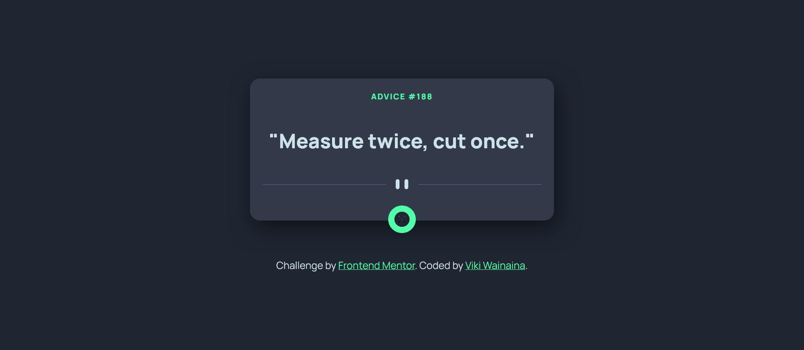

# Frontend Mentor - Advice generator app

This is a solution to the [Advice generator app challenge on Frontend Mentor](https://www.frontendmentor.io/challenges/advice-generator-app-QdUG-13db). Frontend Mentor challenges help you improve your coding skills by building realistic projects.

## Welcome! 👋

[Frontend Mentor](https://www.frontendmentor.io) challenges help you improve your coding skills by building realistic projects.

**To do this challenge, you need a basic understanding of HTML, CSS and JavaScript.**

## The challenge

The challenge is to build out this advice generator app using the [Advice Slip API](https://api.adviceslip.com) and get it looking as close to the design as possible.

Your users should be able to:

- View the optimal layout for the app depending on their device's screen size
- See hover states for all interactive elements on the page
- Generate a new piece of advice by clicking the dice icon

**Have fun building!** 🚀
